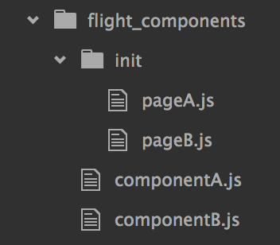

The world of JavaScript modules and package managers can be a fragmented place. With a mixture of AMD, Bower, npm and CommonJS it can sometimes lead to interoperability headaches. 

In this post we'll look at how CommonJS and AMD can live together in the same code base with some examples.

> If you need a refresher on the different module formats then Addy Osmani has you covered with [this excellent article](http://addyosmani.com/writing-modular-js/)

## webpack

When searching for an alternative to [Browserify](http://browserify.org/), I stumbled across [webpack](http://webpack.github.io). Not only does it allow seamless use of AMD and CommonJS (the bit we're interested in!) it also has some other excellent features, such as code splitting and bundling of other static assets like CSS and images.

Pete Hunt recently [gave a talk](https://www.youtube.com/watch?v=VkTCL6Nqm6Y) detailing how they use it at Instagram. Worth a watch.

## A use case

Twitter's Flight JS library is a good example of an AMD only library that (until recently) is published exclusively on Bower. Consequently the ecosystem of useful third party components are written and published in the same way.

Recently I had a need for Flight but wanted to consume it in CommonJS land which would allow me to use various other useful modules from npm.

Let's walk through a basic example:

### Writing a Flight JS component

Here's a Flight component, written in CommonJS format:

``` js
var flight = require('flightjs');

module.exports = flight.component(componentUI);

function componentUI() {
  console.log('Ready!');
}
```

This does nothing more than log some text to the console upon initialisation. Great. What is important to note is `flight` is required despite it being written in AMD format. webpack handles it all for us.

If I wanted to use this component I could require it from some kind of initialisation file, like `init.js`:

``` js
var componentUI = require('./component_ui');

componentUI.attachTo('.Component');
```

When built, webpack will spit out a single (or multiple if we wish) file that contains the Flight library and my really awesome `componentUI`.

Assuming the Flight library is installed via Bower, the next step would be configuring webpack.

### Configuring webpack

webpack works best as a global node module, which can be easily installed with:

    npm install webpack -g

To configure it we can opt to either pass flags on the CLI or create a `webpack.config.js`. For anything other than simple examples I tend to prefer the latter.

Here's how compiling the Flight code from earlier might look:

``` js
module.exports = {
  entry: {
    flight: './flight_components/init.js'
  },
  output: {
    path: './built',
    filename: '[name].built.js'
  },
  resolve: {
    modulesDirectories: [
      'node_modules',
      'bower_components',
      'flight_components'
    ],
    alias: {
      'flightjs': 'flight',
    }
  }
};
```

> You can see that webpack allows aliasing of modules. Flight has been recently released on npm as `flightjs` whilst it exists on Bower as `flight`. By using this alias I have made it easy to switch over to the npm version should I wish to.

Providing the config file was placed in the root of my project, I could simply run `webpack` on the command line and expect a `flight.built.js` file to be output in the specified directory. This script file is now ready to be dropped into our site/application.

## Avoiding duplicated code

The above example works well to demonstrate how all the JS can be built into one file. If I were to add another Flight component that was to be used on a separate page, we would end up with two JS files that both had the entire Flight library baked in. Not ideal.

Thankfully webpack has a simple way to allow common modules to be shared.

Let's try again with two very basic components:

**componentA.js**

``` js
var flight = require('flightjs');

module.exports = flight.component(componentA);

function componentA() {
  this.after('initialize', function() {
    console.log('componentA is ready!');
  });
}
```

**componentB.js**

``` js
var flight = require('flightjs');

module.exports = flight.component(componentB);

function componentB() {
  this.after('initialize', function() {
    console.log('componentB is ready!');
  });
}
```

This time there will be two init files, `pageA.js` and `pageB.js` and I've organised them in a directory as shown:



If I were to add these two init files to the `entry` object in our config then I would expect two built files `pageA.built.js` and `pageB.built.js`. Unfortunately both of these files would include the entire Flight library.

To solve this webpack allows us to introduce a third built file that contains the shared code and enables the individual files to reference other modules via a global function. We'll call this `shared.js`.

### Updating the config

For this to work we need to make use of a webpack plugin called [`CommonsChunkPlugin`](http://webpack.github.io/docs/list-of-plugins.html#commonschunkplugin):

``` js
var webpack = require('webpack');

module.exports = {
  entry: {
    pageA: './flight_components/init/pageA.js',
    pageB: './flight_components/init/pageB.js'
  },
  output: {
    path: './built',
    filename: '[name].built.js'
  },
  resolve: {
    modulesDirectories: [
      'node_modules',
      'bower_components',
      'flight_components'
    ],
    alias: {
      'flightjs': 'flight',
    }
  },
  plugins: [
    new webpack.optimize.CommonsChunkPlugin('shared', 'shared.js', null, 2)
  ]
};
```

Now when `webpack` is run we should end up with `pageA.built.js`, `pageB.built.js` and `shared.js`. They can be used like so:

``` html
<script src="shared.js"></script>
<script src="pageA.js"></script>
```

##  Example

The above Flight examples can be found [in this repository](https://github.com/simonsmith/webpack-example). I've also included a React example with a JSX compiler plugin.

## Additional resources

* [webpack-howto](https://github.com/petehunt/webpack-howto)
* [List of tutorials](http://webpack.github.io/docs/list-of-tutorials.html)


