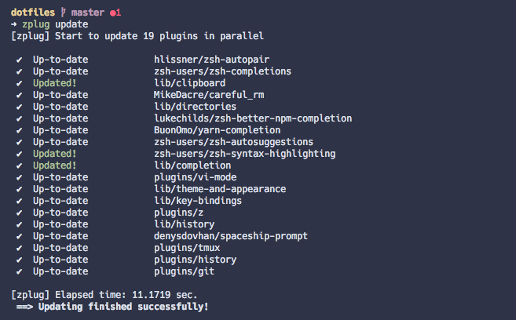
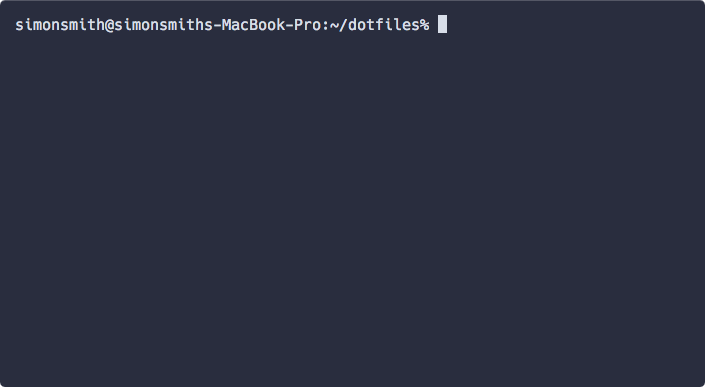
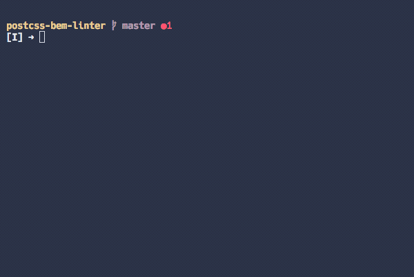
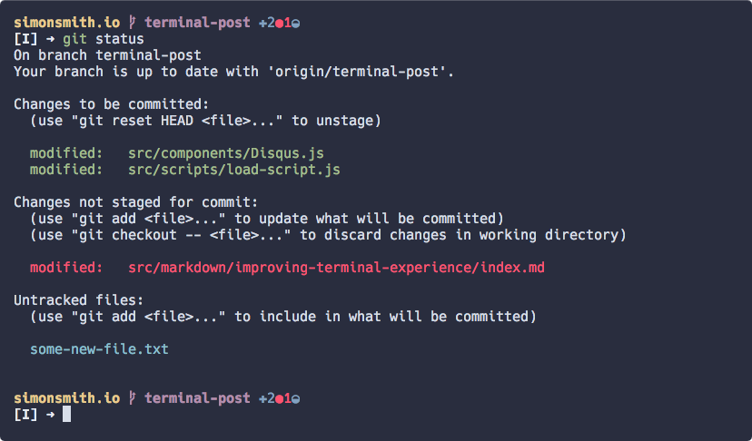
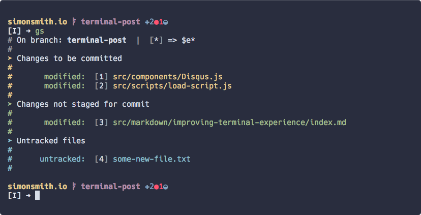
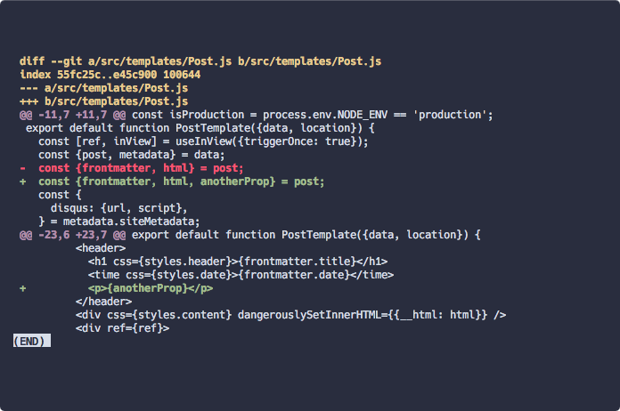
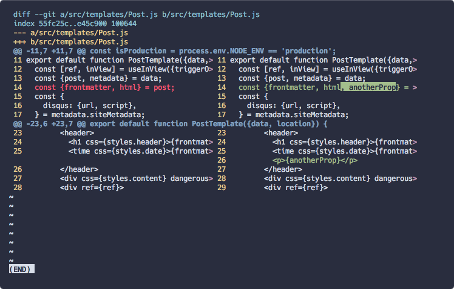

In modern web development it's almost a requirement to use a terminal and be
familiar with the CLI to some degree. With tools such as npm, webpack and Babel
all running from the command line you'd be hard pushed to find a project that
doesn't require knowledge of it.

That being said I've worked in a lot of different places over the years and it
surprises me how often people are happy to work with a very basic terminal
setup. Perhaps a more useful prompt will be installed, or some Git shortcuts but
there is a _whole_ lot more that can be utilised to provide a more streamlined
experience.

In this post I'll be looking at how you can up your terminal game.

## Choosing a terminal emulator

By default your OS will usually provide a terminal emulator for you to use
and most of the time it will suffice but a lot of useful features can be missing
such as paste history, rendering images or creating window splits. For that
reason it's useful to check out some alternatives. Here are my favourites:

* [Alacritty](https://github.com/jwilm/alacritty) - My current terminal
  of choice. It's cross platform, lightweight and also supports GPU rendering
  which is extremely useful for a nice smooth experience when scrolling large
  blocks of text or using terminal based editors like Vim.
* [iTerm2](https://www.iterm2.com) - Tends to be the go to replacement on macOS
  and for good reason. It's full of features and very customisable.
* [Kitty](https://sw.kovidgoyal.net/kitty) - Another cross platform terminal
  designed for keyboard power users.

If you need more options then give this list a whirl:

* https://terminalsare.sexy/#terminal-emulation-applications

## A quick note on Homebrew

Most Linux distributions will ship with a package manager (`apt` on Ubuntu for
example) that easily allows installation and updating of various open source
command line tools.

macOS offers no such thing out of the box, which is why we have the excellent
[Homebrew](https://brew.sh). If you're not using this already then take a moment
to install it as it will be critical for managing a lot of the tools in this
post.

You can even install macOS apps, fonts and other plugins with `brew cask`!

## Using zsh

Zsh and Bash are examples of shell interpreters and are what you interact with
when running commands and applications on the command line.

By default on macOS you will find yourself using Bash but it's recommended to
switch to zsh. There are a lot of [great
features](https://github.com/hmml/awesome-zsh) that exist out of the box and
there are a plethora of Zsh plugins & frameworks available to make things
even sweeter.

### How to switch to it?

If you take a look inside `/etc/shells` it will reveal all the shells available
on your machine. On macOS you will see:

```bash
# List of acceptable shells for chpass(1).
# Ftpd will not allow users to connect who are not using
# one of these shells.

/bin/bash
/bin/csh
/bin/ksh
/bin/sh
/bin/tcsh
/bin/zsh
```

And if you run `echo $SHELL` it will report back what the current default is. On
a fresh installation that will be `/bin/bash`. To switch to a different shell we
can use the `chsh` command:

```bash
# -s newshell
#   Attempt to change the user's shell to newshell.

chsh -s /usr/zsh
```

But hold on just a second! The version of `zsh` that you find installed on macOS
by default is quite old (usually 5.3) so it's recommended to grab the latest
from Homebrew and use that instead:

```bash
brew install zsh
```

Once installed, add the Homebrew version to `/etc/shells` and run `chsh` again:

```bash{11}
# List of acceptable shells for chpass(1).
# Ftpd will not allow users to connect who are not using
# one of these shells.

/bin/bash
/bin/csh
/bin/ksh
/bin/sh
/bin/tcsh
/bin/zsh
/usr/local/bin/zsh
```
```bash
chsh -s /usr/local/bin/zsh
```

We can even create a simple script to perform the above steps for us. Save this
to `zsh.sh` and run it on the CLI:

```bash
brew install zsh
sudo sh -c 'echo "/usr/local/bin/zsh" >> /etc/shells'
chsh -s /usr/local/bin/zsh
```

The rest of this post will assume you are using Zsh.

## Extending Zsh with plugins and frameworks

One of the great things about Zsh is the sheer amount of frameworks and plugins
at your disposal. Plugins will add a certain feature whilst a framework will
typically gather together a host of plugins, aliases, theming options and other
goodies into one package.

### Plugin management

Before adding any plugins it's worth investing in a plugin manager to handle
the installation and updating of each one:



* [zplug](https://github.com/zplug/zplug) (recommended)
* [zgen](https://github.com/tarjoilija/zgen)
* [antigen](https://github.com/zsh-users/antigen)

### Frameworks

* [oh my zsh](https://ohmyz.sh/) - Possibly the most popular framework for Zsh.
This is the one I use a few features from. The [Git
aliases](https://github.com/robbyrussell/oh-my-zsh/wiki/Cheatsheet) are a
particular favourite.

* [Prezto](https://github.com/sorin-ionescu/prezto) - Another extremely popular
framework.

There are many options available:

* https://github.com/unixorn/awesome-zsh-plugins#frameworks

### Useful plugins

There are [far too many
plugins](https://github.com/unixorn/awesome-zsh-plugins#plugins) for me to list,
so here are a few of my personal recommendations:

* [zsh-completions](https://github.com/zsh-users/zsh-completions) This should
almost be a mandatory plugin. Dozens of tab completions for various tools.

* [zsh-syntax-highlighting](https://github.com/zsh-users/zsh-syntax-highlighting) -
Top feature is highlighting valid commands in green as you type.

* [zsh-autosuggestions](https://github.com/zsh-users/zsh-autosuggestions) -
This will offer a suggestion as a command is typed. I recommend changing the
default key binding so as not to lose the existing functionality provided by
tab. I'm using `CTRL+O`.

* [zsh-autopair](https://github.com/hlissner/zsh-autopair) - Saves a lot of
hassle when using quotes and braces.


## Prompt

A good terminal prompt can be a massive benefit to your development experience.
Showing the current directory, Node version or Git status are all possibilities.
It also helps if it looks nice too!




> If you use a framework like oh-my-zsh then there are plenty of [themes
  available](https://github.com/robbyrussell/oh-my-zsh/wiki/Themes).

Some recommended prompts that are framework agnostic:

* [Spaceship](https://github.com/denysdovhan/spaceship-prompt) - I've been a
  happy user of this for a while now. A ton of options and very easy to add
  your own customisations.

* [Bullet Train](https://github.com/caiogondim/bullet-train.zsh) - Another
  highly customisable option.

* [Pure](https://github.com/sindresorhus/pure) - Minimal and fast.

## FZF

If there was one tool to recommend above all others it would be
[FZF](https://github.com/junegunn/fzf). It describes itself as "a
general-purpose command-line fuzzy finder" and it has wide range of uses.

### History search

Searching shell history with `CTRL-R` is a significant time saver. No need for
dozens of aliases when a rough match for a command can be entered:


### File search

Similar to the history, but the file search (triggered with `CTRL-T`) will index
the current directory and everything below, allowing you to select a file and
output the full path to the CLI. It even supports selections (with `TAB`) to
output multiple paths:



### Searching Git history

The above commands come 'out of the box' but on the [FZF
wiki](https://github.com/junegunn/fzf/wiki/) you can find dozens of
additional ways to integrate FZF into other tools. My favourite is the `fshow`
function which allows easier browsing of Git history:


* https://github.com/junegunn/fzf/wiki/Examples#git

## Git

Using Git via the CLI is where it really pays to have some decent shortcuts in
place. It's often one of the more heavily used tools outside the text editor.

### Saving time with aliases

The key to working efficiently with Git is mastering a set of aliases for common
tasks, such as commit, merge and rebase. Personally I recommend the [oh-my-zsh
Git aliases](https://github.com/robbyrussell/oh-my-zsh/wiki/Cheatsheet),
particularly as they are likely to be installed on other machines that you may
use.

### Avoid using full paths with git commands

A common pain point is using full paths to files with commands such as
`git add` or `git reset`. By default `git status` provides the following:



To specifically commit the `Disqus.js` file here I'd need to type:

```bash
git add src/components/Disqus.js
```

Whilst it's possible to tab complete the names, it can quickly become tiresome
if there are many files to add that are all scattered across different parts of
the project.

Enter `scmpuff`:



[scmpuff](https://mroth.github.io/scmpuff/) enhances `git status` by adding
numeric shortcuts to each file. Now the above command can be replaced with `ga 1`.

A definite time saver with commands like `add`, `commit` and `diff`. It even
supports a mixture of ranges, e.g. `ga 2 3-5`.

## Fancy diffing

By default Git provides a basic experience when running `git diff` and this
leads many people to reach for one of the various GUI Git applications:



This isn't terrible by any means but when comparing larger diffs it's also nice
to see what characters in a line actually changed. This is where
[diff-so-fancy](https://github.com/so-fancy/diff-so-fancy) steps in:


What started as [a
commit](https://github.com/paulirish/dotfiles/commit/6743b907ff586c28cd36e08d1e1c634e2968893e#commitcomment-13349456)
to Paul Irish's dotfiles has become an effective standalone tool.

> I recommend installing diff-so-fancy via Homebrew instead of using `npm install -g` as
  it's quite common to switch Node versions with something like `nvm` and then
  forget that global modules are also lost.

## Side by side

For those that prefer side-by-side diffs then
[ydiff](https://github.com/ymattw/ydiff) is one option:



It can be useful to add an alias or two for this as it's quite a hassle to type
each time:

```bash
# Mnemonic I use is 'git diff side'
alias gds='ydiff -s -w 0'
# And 'git diff cached side'
alias gdcs='git diff --cached | ydiff -s -w 0'
```

## z

Once you've spent some time using the CLI to navigate around to various
directories it's possible to determine which places you visit most frequently.

Taken from [the z README](https://github.com/agkozak/zsh-z)

> z is a command line tool that allows you to jump quickly to directories that
  you have visited frequently in the past, or recently -- but most often a
  combination of the two (a concept known as "frecency")


## nnn

* Link and overview

## tmux

## ack, rg, sed

* Useful to know the basics
* csswizardry link maybe?

## automating terminal startup

* tmuxinator
* itermocil
* teamocil

## nvm and alternatives

## direnv

## common commands and tips

* get used to cp and mv, with {} expansion
* piping commands (alias and rg)
* pbcopy & pbpaste (into new file with >)
* ps aux
* less (configure in dotfiles)
* careful_rm

## alias and functions


## Managing dotfiles

* Benefits
* Overview of how I solve it and link to dotfiles
* Dotfiles link on github
