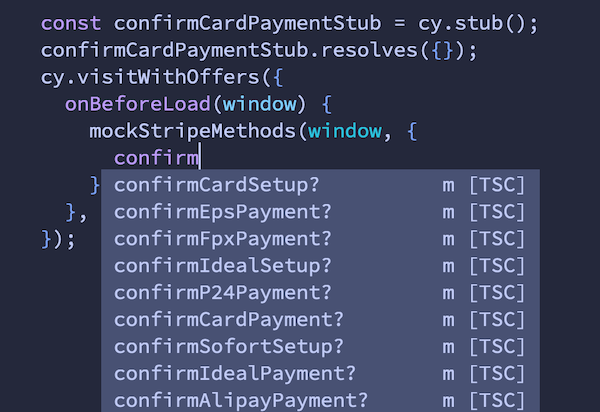

In this post we will be looking at how to create mock functions for any of the
methods returned by Stripe.js within a Cypress test and also go through example
of leveraging this to to test Apple Pay in the Chrome browser.

## How the Stripe library works

According to [the documentation](https://stripe.com/docs/js/initializing) the
`Stripe` function returns an object which contains the various methods that form
the Stripe API:

```js
const stripe = Stripe('pk_test_TYooMQauvdEDq54NiTphI7jx', {
  /* options */
});

// stripe holds all the methods we'd like to mock
{
  confirmCardPayment,
  updatePaymentIntent
  paymentRequest
  // -- etc
}
```

There are also a lot of internal methods and other functionality that we will
want to preserve alongside the mocked methods. This means things like locales
will still work.

To achieve this the following steps are needed:

* In our tests load the Stripe library
* Store a reference to the global `Stripe` function
* Create our own `Stripe` global function that returns the same object as the
  original, and then mix in our own mock overrides.

## Overriding the Stripe library in the tests

In our tests we will be adding the following snippet:

```html
<script src="https://js.stripe.com/v3/"></script>
<script>
  if (window.mockStripeMethods) {
    const origStripe = window.Stripe;
    window.Stripe = (...args) => {
      return {
        ...origStripe(...args),
        ...window.mockStripeMethods,
      };
    };
  }
</script>
```

So where does `window.mockStripeMethods` come from, and why are we adding the
Stripe library via a `script` element just above?

It's important that we can get a reference to the original Stripe library, and
to guarantee that it is available at this point we ensure it's loaded
synchronously before the snippet. You can skip this step if you've already
loading Stripe in this way.

Remember that the above snippet can go in the head or at the end of the body,
it doesn't really matter. So adjust this based on how your application uses
Stripe.

But what about if you load the library asynchronously in your application via
the [loadStripe function?](https://github.com/stripe/stripe-js#importing-loadstripe-without-side-effects).

Thankfully we can take advantage of the fact that if Stripe is [already detected on the window object](https://github.com/stripe/stripe-js/blob/bf6a51920db5e8c848792264d91c17b52c438e09/src/shared.ts#L88-L91)
then `loadStripe` just returns that instead of trying to load the library.
Within the HTML template for your application we can restrict loading Stripe
synchronously to only happen in Cypress. Let's look at that next.

### Loading Stripe synchronously only in Cypress

The following will work with the
[html-webpack-plugin](https://github.com/jantimon/html-webpack-plugin) but a
similar technique can be applied to any templating language. The first step is
to pass an environment variable through to the template at build time:

```js
new HtmlWebpackPlugin({
  filename: 'index.html',
  template: './src/templates/index.html',
  isCypress: process.env.IS_CYPRESS === 'true',
})
```

Then in the template the value can be detected and the snippet is output:

```html
<% const isCypress = htmlWebpackPlugin.options.isCypress;
if (isCypress) { %>
  <script src="https://js.stripe.com/v3/"></script>
  <script>
    if (window.mockStripeMethods) {
      const origStripe = window.Stripe;
      window.Stripe = (...args) => {
        return {
          ...origStripe(...args),
          ...window.mockStripeMethods,
        };
      };
    }
  </script>
<% } %>
```

And finally, prepend the test command with the environment variable:

```bash
IS_CYPRESS=true yarn test:cypress
```

### Adding the mock methods to the window object

The last part of this setup is to address where the `window.mockStripeMethods`
will come from.

Cypress has [the `onBeforeLoad` option](https://docs.cypress.io/api/commands/visit#Provide-an-onBeforeLoad-callback-function)
that is passed to the `visit()` command. This callback is called as soon as
possible with the `window` of our current test and before any scripts have loaded. This makes it the ideal place to add our desired overrides:

```js
// example.spec.js
const confirmCardPaymentStub = cy.stub();

cy.visit('http://localhost:3000/#dashboard', {
  onBeforeLoad: (window) => {
    window.mockStripeMethods = {
      confirmCardPayment: confirmCardPaymentStub
    }
  },
})
```

And for TypeScript users we can add a simple helper function to provide the
correct types for available Stripe methods:

```ts
// mockStripe.ts
import {Stripe} from '@stripe/stripe-js';

type MockMethods = Partial<Record<keyof Stripe, unknown>>;
type Win = Cypress.AUTWindow & {mockStripeMethods?: MockMethods};

export const mockStripeMethods = (window: Win, methods: MockMethods) => {
  window.mockStripeMethods = methods;
};

// example.spec.ts
const confirmCardPaymentStub = cy.stub();

cy.visit('http://localhost:3000/#dashboard', {
  onBeforeLoad: (window) => {
    mockStripeMethods(window, {
      confirmCardPayment: confirmCardPaymentStub
    });
  },
})
```



### Assert that the stub was called

With the stub in place the next step would be perform some actions in your
application to submit a payment and then use `expect` to validate that the stub
was called as expected:

```ts
const confirmCardPaymentStub = cy.stub();
// `confirmCardPayment` always returns a promise, so mock that here
confirmCardPaymentStub.resolves({});

cy.visit('http://localhost:3000/#dashboard', {
  onBeforeLoad(window) {
    mockStripeMethods(window, {
      confirmCardPayment: confirmCardPaymentStub,
    });
  },
});
// Some custom helpers here to perform some user actions
cy.populateCardDetails();

cy.submitForm().then(() => {
  // Ensure we validate the stub has been called in a `then` callback
  expect(confirmCardPaymentStub).to.have.been.called;
});
```

## Real world example: Mocking the `stripe.paymentRequest` API

Now that all the pieces are in place we can attempt to test something a bit
trickier, the [Payment Request API](https://stripe.com/docs/js/payment_request)
that Stripe conveniently wraps for us.

This API is used to detect whether a browser supports payment methods like Apple
or Google Pay and then handles accepting payments via these APIs.

Testing Apple Pay is an interesting one because it only works in Safari and of
course Cypress primarily runs on the Blink engine via Chromium/Chrome or
Electron.

However in reality we don't actually _need_ Safari to be able to test this flow,
and we can use our new mocking skills to trick Stripe into rendering the Apple
Pay button in Chrome

### How the Stripe API works

If we take a look at [the documentation](https://stripe.com/docs/stripe-js/elements/payment-request-button)
we can see there a few steps:

* Create an instance of a `paymentRequest` object
* Check if the browser supports Apple with `canMakePayment`
* Open the browser interface with `show`
* Listen for the `paymentmethod` event on the `paymentRequest` object when the user
  submits the payment

Let's look at that in steps of code so we can figure out what our mock will
look like

```js
// Creating the payment request object. We will want a `paymentRequest` stub that
// can return an object
const paymentRequest = stripe.paymentRequest({
  country: 'US',
  currency: 'usd',
  total: {
    label: 'Demo total',
    amount: 1099,
  },
});

// `await` a promise from `canMakePayment`. Will return an object that indicates
// support
const support = await paymentRequest.canMakePayment();
// {googlePay: false, applePay: true}

// Add a handler to `paymentRequest`
// We will need some form of event registry that can store the event
// handler callback here and allow us to call it in the test
paymentRequest.on('paymentmethod', (event) => {
  // - handle payment
});
```
