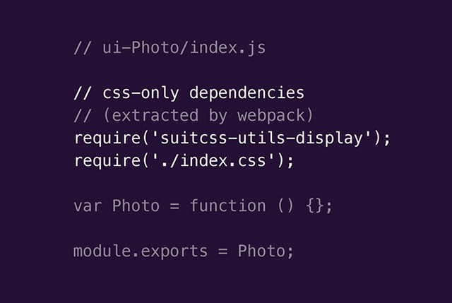
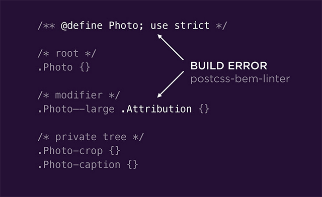

I recently stumbled across [an excellent talk](https://www.youtube.com/watch?v=L8w3v9m6G04) by Nicolas Gallagher at dotCSS 2014 titled "Thinking beyond Scalable CSS" where he shed some light on how Twitter organise their UI components.

I found two slides interesting in particular:




I thought it might be interesting to apply a similar approach to organising [React](https://facebook.github.io/react/) components with [webpack](webpack.github.io).

## Directory structure

I'll use a fictional React application as an example:

``` bash
├── components
│   ├── ui-App
│   │   ├── index.css
│   │   └── index.js
│   ├── ui-Avatar
│   │   ├── index.css
│   │   └── index.js
│   └── ui-Profile
│       ├── fonts
│       │   └── opensans-regular-webfont.woff
│       ├── images
│       │   └── icon-user.png
│       ├── index.css
│       └── index.js
└── styles
    ├── base.css
    └── theme.css
```

The idea here is to keep React components and their assets contained inside individual directories within `components`. The `ui-App` component can act as our top level that brings them all together.

Adjacent to that directory are `styles` that can apply to the whole application, agnostic of any components.

## Using App as the entry point

When building applications with webpack you need to define one or more entry points so that it knows where to begin hunting for dependencies. Since it's fairly common for React components to have a top level 'controller' component this seems a good place to start.

**ui-App/index.js**

``` js
import './index.css';

import React from 'react';
import Profile from 'components/ui-Profile';

export default React.createClass({
  displayName: 'App',

  render() {
    return (
      <div className="App">
        <div className="App-item">
          <Profile user={this.props.userData}/>
        </div>
      </div>
    )
  }
});
```

It does nothing more than pull in a `Profile` component and then render it with some data. Note that a reference to the `index.css` is also included with the JS dependencies.

What's interesting to note is that the `Profile` component will have also listed any dependencies (CSS, images etc) that it needs and with the help of webpack we can grab hold of those too and ensure they're packaged up.

## Configuring webpack

For everything to work smoothly we'll need to tell webpack how to handle the various files it encounters. We can do this with [loaders](http://webpack.github.io/docs/loaders.html):

``` js
var ExtractTextPlugin = require('extract-text-webpack-plugin');

module.exports = {
  entry: {
    homepage: './src/components/ui-App/',
  },

  output: {
    path: './dist/',
    filename: 'app.js'
  },

  // Resolve the `./src` directory so we can avoid writing
  // ../../styles/base.css
  resolve: {
    modulesDirectories: ['node_modules', './src'],
    extensions: ['', '.js', '.jsx']
  },

  // Instruct webpack how to handle each file type that it might encounter
  module: {
    loaders:[
      { test: /\.js[x]?$/, exclude: /node_modules/, loader: 'babel-loader' },
      { test: /\.css$/, loader: ExtractTextPlugin.extract('style-loader', 'css-loader') },
      { test: /\.(png|jpg)$/, loader: 'file-loader?name=images/[name].[ext]' },
      { test: /\.woff$/, loader: 'file-loader?name=fonts/[name].[ext]' }
    ]
  },

  // This plugin moves all the CSS into a separate stylesheet
  plugins: [
    new ExtractTextPlugin('app.css')
  ]
};

```

The [file loader](https://github.com/webpack/file-loader) is used to pick up binary assets and copy them to a relevant directory. The path to the asset is then returned so that they can be referenced from the CSS.

Loaders can be chained together to allow additional processing of assets, such as CSS preprocessors or [image compression](https://github.com/tcoopman/image-webpack-loader). In the above example we're also using the [ExtractTextPlugin](http://webpack.github.io/docs/stylesheets.html#separate-css-bundle) to resolve the dependency graph for the CSS and output it into a separate file.

At this point if we try running the `webpack` command there should be a `dist` folder containing everything:

``` bash
dist/
├── app.css
├── app.js
├── fonts
│   └── opensans-regular-webfont.woff
└── images
    └── icon-user.png
```

## Including additional global styles

So far the CSS from the `styles` directory has not been included. There are two approaches to this.

### Each component explictly requires style dependencies

If the intention is for components to be reused in other projects it might make sense for each one to require the styles it needs, even if this means you have repeated `require` or `import` statements:

**ui-Profile/index.js**

``` js
import 'suitcss-base';
import 'styles/theme.css';
import 'styles/base.css';
import './index.css';

// ...rest of the component
```

**ui-Avatar/index.js**

``` js
import 'suitcss-base';
import 'styles/theme.css';
import 'styles/base.css';
import './index.css';

// ...rest of the component
```

webpack will be smart enough to see if more than one component has requested the same stylesheet and ensure the order is correct and without duplicates in the resulting `.css` file.

### Require all style dependencies in the top level component

On the other hand if you know that the components are unlikely to live outside of this app, or that the styles are too app specific then it sometimes makes sense to just include them at the top level component instead.

**ui-App/index.js**

``` js
import 'suitcss-base';
import 'styles/theme.css';
import 'styles/base.css';
import './index.css';

// ...rest of the component
```

**ui-Profile/index.js**

``` js
import './index.css';

// ...rest of the component
```

**ui-Avatar/index.js**

``` js
import './index.css';

// ...rest of the component
```

> [`suitcss-base`](https://github.com/suitcss/base) would need to be installed from `npm` in the above examples

Now if webpack was run for a second time the `app.css` would contain the additional styles.

## Adding PostCSS as an additional loader

[PostCSS](https://github.com/postcss/postcss) is a post-processor that allows transformation of CSS with various JS plugins, many of which are very useful like [autoprefixer](https://github.com/postcss/autoprefixer).

It's a great tool (Twitter is already using it) with [some excellent plugins](https://github.com/postcss/postcss#plugins) and one of those is [postcss-import](https://github.com/postcss/postcss-import). This can offer us the alternate route of letting the CSS files manage their dependencies instead of the JS.

To use it we need to add a [postcss-loader](https://github.com/postcss/postcss-loader) into the mix, which is as simple as installing it from npm and updating the `webpack.config.js`:

``` bash
npm install postcss-loader
```
**webpack.config.js**

``` js
// Only showing additions

var atImport = require('postcss-import');

module: {
  loaders: [ { test: /\.css$/, loader: ExtractTextPlugin.extract('style-loader', 'css-loader!postcss-loader') }
  ]
}

{
  postcss: [
    atImport({
      path: ['node_modules', './src']
    })
    // Other PostCSS plugins
  ]
}
```

With that in place the `import` statements from the JS files can move into the CSS:

**ui-App/index.js**

``` js
import './index.css';

import React from 'react';
import Profile from 'components/ui-Profile';

export default React.createClass({
// ...rest of the component
});
```

**ui-App/index.css**

``` css
@import 'styles/theme.css';
@import 'styles/base.css';

.App-item {
  width: 300px;
}
```

The dependencies will now be resolved the same way as before.

## Linting CSS components

One slide from the talk demonstrated use of another PostCSS plugin - [postcss-bem-linter](https://github.com/necolas/postcss-bem-linter):



This checks that CSS components conform to predefined naming conventions and now that our webpack config is using PostCSS this can easily be dropped in:

``` bash
npm install postcss-bem-linter
```

``` js
{
  postcss: [
    atImport(),
    autoprefixer(),
    bemLinter()
  ]
}
```

Now, if any of the components fail the linting then the error is reported to us in the console:

``` bash
WARNING in ./~/css-loader!./~/postcss-loader!./src/components/ui-Profile/index.css
    postcss-bem-linter: /Users/simonsmith/Sites/react-webpack-assets/src/components/ui-Profile/index.css:10:1: Invalid component selector ".Profil"
```

## Wrapping up

Hopefully that sheds some light on how powerful tools like webpack and PostCSS are and how useful they can be in your build pipeline.

The code in this post is [viewable on GitHub](https://github.com/simonsmith/react-component-assets-webpack) with a working example.

### Resources

* [Thinking beyond "Scalable CSS"](https://www.youtube.com/watch?v=L8w3v9m6G04)  - [Slides](https://speakerdeck.com/necolas/thinking-beyond-scalable-css)
* [Making Twitter UI Infrastructure](https://vimeo.com/109918301) - [Slides](https://speakerdeck.com/necolas/making-twitter-ui-infrastructure)
* [Block, Element, Modifying Your JavaScript Components](https://medium.com/seek-ui-engineering/block-element-modifying-your-javascript-components-d7f99fcab52b)
* [SUIT CSS](http://suitcss.github.io/)
